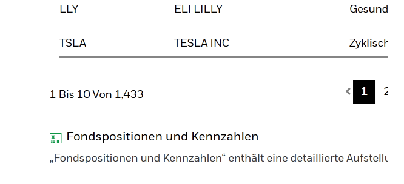

# **Automated iShares ETF Portfolio Analysis: Stocks, Sectors, and Countries**

This project provides automated analysis of a portfolio of ETFs, stocks and cryptocurrencies. It automates the download of ETF data from the BlackRock website, integrates stock prices via the Yahoo Finance API and creates interactive visualisations for the top 100 stocks, sectors and countries.

## **`portfolio.xlsx` - how does it look like?**

Check the example file in the repository. The file should be saved in ´INPUTFILE´. 
The file should have the following columns:

- `Ticker`: Check Ticker via Yahoo Finance. You don't need to add the suffix. (e.g., Microsoft's ticker is MSFT, but for Germany Xetra it is MSF)
- `Art`: Class of security (e.g., Stock aka "Aktie", ETF, Crypto aka "Krypto")
- `Position`: Name of security (e.g., Microsoft, iShares MSCI World UCITS ETF, Bitcoin). The name should match the names in the ETF CSV files (so use the iShares framing).
- `Sektor`: Sector of the security (e.g., Technology, Financials, Consumer Discretionary). Should match the sector in the ETF CSV files (so use the iShares framing).
- `Standort`: Country of the security (e.g., United States, Germany, China). Should match the country in the ETF CSV files (so use the iShares framing).
- `Anteile`: Number of shares of the security

### **Here is an example structure of the `portfolio.xlsx` file:**
```markdown
| Ticker | Art   | Position                                    | Sektor                  | Standort     | Anteile |
|--------|-------|---------------------------------------------|-------------------------|--------------|---------|
| -      | Cash  | Cash                                        | Cash und/oder Derivate  | Cash (Euro)  | 1000    |
| 2B7K   | ETF   | iShares MSCI World SRI ETF                  | -                       | -            | 1000    |
| QDVW   | ETF   | iShares MSCI World Quality Dividend ESG ETF | -                       | -            | 500     |
| BTC    | Krypto| Bitcoin                                     | Krypto                  | Krypto       | 1       |
| AAPL   | Aktie | Appel Inc.                                  | Technologie             | USA          | 100     |
```
`Cash` should be added as a security with the ticker `-`. `Anteile` should be the amount of cash in the portfolio.

## **Globale variables: Import folder paths, URLs, Names for CSV files and ticker suffixe**
For easier handling, the global variables are stored in a `.env` file. The file should be saved in the same folder as the script.

### **How to set up the `.env` file?**
The .env file makes it easy to change configurations such as paths and URLs without having to change the code.

The `.env` file should look like this:
```dotenv
FOLDER_PATH="path to the folder where the files should be stored"
DOWNLOAD_PATH="${FOLDER_PATH}\\downloadfiles"
SAVE_PATH="${FOLDER_PATH}\\outputfiles"
INPUT_FILE="${FOLDER_PATH}\\portfolio.xlsx"
OUTPUT_FILE="${SAVE_PATH}\\stockoverview.xlsx"
CSV_URL="https://example.com/etf1.csv, https://example.com/etf2.csv"
ETF_CSV_FILE="ETF_1.csv, ETF_2.csv"
STOCK_TICKER_SUFFIXES="stock ticker suffix1, stock ticker suffix2, stock ticker suffix3"
CRYPTO_TICKER_SUFFIXES="crypto ticker suffix1, crypto ticker suffix2, crypto ticker suffix3"
```
- `CSV_URL` should be the URL of the iShares ETF CSV files. You can find the URLs on the BlackRock website.

- `ETF_CSV_FILE` and `CSV_URL` have to be in the same order. Separate the URLs and the file names with a comma. Add as many URLs and file names as you need.
- `STOCK_TICKER_SUFFIXES` and `CRYPTO_TICKER_SUFFIXES` are optional. Default is `.DE` for Xetra and `-EUR` for crypto in Euro**. If you want to add more suffixes, separate them with a comma.

## **How to run the script?**

1. Set up the `.env` file.
2. Create the folder structure as specified in the `.env` file (especially the folders `outputfiles` and `downloadfiles`).
3. Save the `portfolio.xlsx` file in the folder specified in the `.env` file.
4. Run the script. 
5. The charts will be saved in the folder specified in the `.env` file and open automatically in your browser.
6. Check the `stockoverview.xlsx` file in the folder specified in the `.env` file. 
7. Done!
8. If you want to run the script again you are overwriting the `stockoverview.xlsx` file and the charts.
9. The ETF CSV files will only be downloaded if they are not already in the download folder or are older than 30 day (Interval can be changed via`download_csv_if_old(...,...,max_age_days= ?)` in `main.py`).