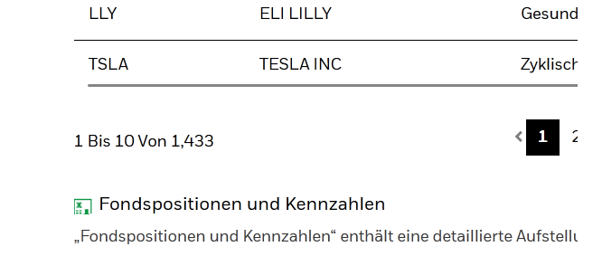

# 📊 iShares ETF Portfolio-Analyse


Automatisierte Analyse und Visualisierung eines gemischten Depots aus ETFs, Einzelaktien, Kryptowährungen und Cash.

Das Script lädt die aktuellen ETF-Zusammensetzungsdaten direkt von BlackRock/iShares, holt Kurse für alle Positionen über Yahoo Finance und verrechnet beides zu einer vollständigen Portfolioanalyse mit **ETF-Durchblick** – d.h. jede Einzelposition innerhalb eines ETFs wird anteilig auf das Gesamtdepot heruntergebrochen.

Die Ergebnisse werden als **interaktiver HTML-Report** (Pie-Charts, Treemaps, Balkendiagramme, Heatmap, sortierbare Tabellen) sowie als **Excel-Datei** mit 6 Sheets ausgegeben. Der Report öffnet sich nach dem Ausführen automatisch im Browser und ist vollständig offline-fähig – kein Webserver nötig.

**Typische Fragen die das Tool beantwortet:**
- Wie ist mein Depot nach Assetklasse, Sektor und Land aufgeteilt?
- Welche Einzelpositionen machen den größten Anteil aus – auch versteckt in ETFs?
- Wo gibt es Klumpenrisiken durch überlappende ETF-Positionen?
- Wie diversifiziert ist mein Depot (HHI-Score)?

---

## ✨ Features

| Feature | Beschreibung |
|---|---|
| **ETF-Durchblick** | Gewichtung jeder ETF-Einzelposition wird auf das Gesamtdepot heruntergebrochen |
| **Kurse via yFinance** | Automatischer Download für Aktien, ETFs und Kryptowährungen |
| **Fallback-Kurse** | Bei fehlendem Live-Kurs wird auf gespeicherte Historien-Kurse zurückgegriffen (`price_fallback.json`) |
| **HTML-Report** | Interaktiver, selbst-enthaltender Report mit Lazy-Loading – kein Webserver nötig |
| **Excel-Export** | Auswertung in 6 Sheets: Depotwerte, Datengrundlage, Aktien, ETFs, Sektoren, Länder |
| **Diversifikations-Score (HHI)** | HHI-Metrik (Skala 0–100, FTC/DoJ-Standard) mit Qualitätsstufe, Positionen, Sektoren, Ländern |
| **Top-5-Konzentration** | Anteil der 5 größten Positionen am Gesamtdepot (inkl. ETF-Durchblick), mit ⚠️ bei > 40 % |
| **Robuste Fehlerbehandlung** | Explizite Warnungen bei fehlenden Kursen, falschem `.env`-Setup oder unvollständigen Metadaten |
| **Datenschutz-Modus** | 🔒-Schalter in der Navigation blendet Gesamtwert, Anteile und Marktwerte aus – Zustand wird gespeichert |
| **Mobil-kompatibel** | Responsive Layout: Hamburger-Menü auf kleinen Bildschirmen, Charts und Tabellen skalieren automatisch |
| **Log-Rotation** | Haupt-Log (`portfolio_analysis.log`) + separater Error-Log (`portfolio_errors.log`) |

### KPI-Cards im HTML-Report

Der Report zeigt oben drei Gruppen von Kennzahlen:

| Gruppe | Cards |
|---|---|
| **Depot-Übersicht** | Gesamtwert · Positionen (ETFs / Aktien / Krypto / Cash) |
| **Assetklassen** | ETF-Anteil · Aktien-Anteil · Krypto-Anteil · Cash-Anteil |
| **Qualität** | Diversifikation (HHI) · Top-5-Konzentration |

Bei fehlenden Live-Kursen erscheint zusätzlich eine ⚠️-Karte mit den betroffenen Tickern.

> **🔒 Datenschutz-Modus:** Über den Schalter oben links in der Navigation lassen sich Gesamtwert, Anteile und Marktwerte in der Tabelle und den KPI-Cards ausblenden (Werte werden unlesbar gemacht, Layout bleibt stabil). Der Zustand wird im Browser gespeichert und beim nächsten Öffnen wiederhergestellt.

### Charts im HTML-Report

1. **Depotübersicht** – Sortierbare & filterbare Tabelle aller Positionen
2. **Übersicht nach Depot** – Kreisdiagramm nach Depotposition
3. **Kapitalverteilung: Anlageart → Position** – Treemap: ETF / Aktie / Krypto / Cash
4. **Top 20 Positionen** – Balkendiagramm inkl. ETF-Durchblick
5. **Länder-Treemap** – Hierarchie: Land → Einzelposition (Hover: Anteil Depot + Anteil Kategorie)
6. **Sektor-Heatmap** – Überschneidungen und Klumpenrisiken je ETF / Assetklasse
7. **Treemap: Sektor → Position** – Hierarchische Sektoransicht inkl. ETF-Durchblick

---

## 📁 Projektstruktur

```
ishares_etf_portfolio_analysis/
│
├── main.py                     # Einstiegspunkt
├── .env                        # Konfiguration (Pfade, URLs, Ticker-Suffixe)
├── requirements.txt
├── ruff.toml                   # Linter-Konfiguration
├── price_fallback.json         # Automatisch erstellt – gespeicherte Fallback-Kurse
├── portfolio_analysis.log      # Haupt-Log (rotierend, max. 5 MB)
├── portfolio_errors.log        # Nur WARNINGs und ERRORs (rotierend, max. 2 MB)
│
├── example_portfolio.xlsx      # Beispiel-Depotdatei
├── iShares_CSV_download_path.png
│
└── scripts/
    ├── data_download.py        # CSV- und Kurs-Download
    ├── data_processing.py      # Bereinigung, Normalisierung, Gewichtungsberechnung
    ├── file_handling.py        # Excel-Import/-Export
    └── plotting.py             # Chart-Erstellung & HTML-Report-Export

tests/
    ├── test_data_processing.py # Tests: Normalisierung, Mapping, Gewichtungsberechnung
    ├── test_data_download.py   # Tests: Fallback-JSON, CSV-Download (gemockt)
    ├── test_file_handling.py   # Tests: Excel-Import/-Export, ETF-CSV lesen
    └── test_plotting.py        # Tests: Zahlenformat, Chart-Figures, HTML-Tabelle
```

---

## 🚀 Einrichtung & Ausführung

### 1. Abhängigkeiten installieren

```bash
pip install -r requirements.txt
```

### 2. `.env`-Datei erstellen

Erstelle eine `.env`-Datei im Projektordner mit folgendem Inhalt:

```dotenv
# Basis-Pfad (wird in den anderen Variablen wiederverwendet)
FOLDER_PATH="C:\Dein\Pfad\Depotaufteilung"

# Unterverzeichnisse (werden automatisch erstellt falls nicht vorhanden)
DOWNLOAD_PATH="${FOLDER_PATH}\downloadfiles"
SAVE_PATH="${FOLDER_PATH}\outputfiles"

# Eingabe- und Ausgabedateien
INPUT_FILE="${FOLDER_PATH}\portfolio.xlsx"
OUTPUT_FILE="${SAVE_PATH}\stockoverview.xlsx"

# iShares ETF CSV-Download-URLs (Reihenfolge muss mit ETF_CSV_FILE übereinstimmen)
CSV_URL="https://...etf1.csv, https://...etf2.csv"
ETF_CSV_FILE="iShares ETF 1.csv, iShares ETF 2.csv"

# Ticker-Suffixe für Yahoo Finance (mehrere durch Komma trennen)
STOCK_TICKER_SUFFIXES=".DE, .F"        # Xetra zuerst, Frankfurt als Fallback
CRYPTO_TICKER_SUFFIXES="-EUR"          # Krypto in Euro
```

> **Wo finde ich die CSV-URLs?**  
> Auf der BlackRock/iShares-Produktseite des jeweiligen ETFs → Button „Alle Positionen herunterladen" → Rechtsklick → Link kopieren.  
> 

### 3. `portfolio.xlsx` erstellen

Speichere deine Depotpositionen in einer Excel-Datei unter `INPUT_FILE`. Pflicht-Spalten:

| Spalte | Beschreibung | Beispiel |
|---|---|---|
| `Ticker` | Yahoo Finance Ticker **ohne** Suffix. Für Cash: `-` | `2B7K`, `AAPL`, `BTC`, `-` |
| `Art` | Assetklasse | `ETF`, `Aktie`, `Krypto`, `Cash` |
| `Position` | Name der Position. Bei ETFs **exakt** wie der CSV-Dateiname (ohne `.csv`) | `iShares MSCI World SRI ETF` |
| `Sektor` | Sektor (nur für Einzelaktien relevant, bei ETFs `-`) | `Technologie`, `-` |
| `Standort` | Land (nur für Einzelaktien relevant, bei ETFs `-`) | `USA`, `Frankreich`, `-` |
| `Anteile` | Anzahl Anteile. Bei Cash: Betrag in Euro | `100`, `2500.00` |

**Beispiel:**

| Ticker | Art | Position | Sektor | Standort | Anteile |
|---|---|---|---|---|---|
| `-` | Cash | Cash | Cash und/oder Derivate | Cash (Euro) | 2500 |
| `2B7K` | ETF | iShares MSCI World SRI ETF | - | - | 500 |
| `QDVW` | ETF | iShares MSCI World Quality Dividend ESG ETF | - | - | 200 |
| `BTC` | Krypto | Bitcoin | Krypto | Krypto | 0.01 |
| `AAPL` | Aktie | Apple Inc. | Technologie | USA | 10 |

> Eine vollständige Beispieldatei liegt im Repository: [`example_portfolio.xlsx`](example_portfolio.xlsx)

### 4. Script ausführen

```bash
python main.py
```

Der Report öffnet sich automatisch im Browser. Ausgaben:

| Datei | Beschreibung |
|---|---|
| `{SAVE_PATH}/portfolio_report.html` | Interaktiver HTML-Report |
| `{SAVE_PATH}/stockoverview.xlsx` | Excel-Auswertung (6 Sheets) |

---

## ⚙️ Konfigurationsoptionen

### ETF-CSV-Aktualisierungsintervall

Die ETF-CSV-Dateien werden nur heruntergeladen wenn sie älter als 30 Tage sind. Das Intervall lässt sich in `main.py` anpassen:

```python
download_csv_if_old(CSV_URL, DOWNLOAD_PATH, ETF_CSV_FILE, max_age_days=30)
```

### Fallback-Kurse (`price_fallback.json`)

Wird automatisch erstellt und bei jedem erfolgreichen Kurs-Download aktualisiert. Falls Yahoo Finance keinen Kurs liefert (z.B. bei delisteten Krypto-Tokens), wird der zuletzt gespeicherte Kurs verwendet.

Initiale Standardwerte:
```json
{
  "MATIC": 0.10
}
```

### Ticker-Suffixe

Das Script probiert die konfigurierten Suffixe der Reihe nach aus (Batch-Download, dann Einzel-Fallback):
- `STOCK_TICKER_SUFFIXES=".DE, .F"` → zuerst Xetra (`.DE`), dann Frankfurt (`.F`)
- `CRYPTO_TICKER_SUFFIXES="-EUR"` → Krypto in Euro

---

## 📋 Logging

| Datei | Inhalt | Max. Größe |
|---|---|---|
| `portfolio_analysis.log` | Alle INFO+ Ereignisse (Meilensteine, Zusammenfassungen) | 5 MB, 3 Backups |
| `portfolio_errors.log` | Nur WARNING+ (Fehler, Fallback-Kurse, fehlende Daten) | 2 MB, 2 Backups |

Für detailliertes Debugging kann der Log-Level temporär auf `DEBUG` gesetzt werden – dann werden auch Einzelkurse, Ticker-Listen und DataFrame-Inhalte geloggt.

---

## 🔧 Troubleshooting

| Problem | Ursache | Lösung |
|---|---|---|
| `Fehlende Pflicht-Umgebungsvariablen` | `.env` unvollständig | Alle Pflicht-Variablen prüfen (siehe Abschnitt `.env`) |
| `CSV_URL (n) und ETF_CSV_FILE (m) haben unterschiedlich viele Einträge` | Anzahl URLs und Dateinamen in `.env` stimmt nicht überein | Reihenfolge und Anzahl von `CSV_URL` und `ETF_CSV_FILE` angleichen |
| `ETF '...' nicht in ETF-CSV-Daten gefunden` | `Position`-Name in `portfolio.xlsx` weicht vom CSV-Dateinamen ab | Namen exakt angleichen (ohne `.csv`-Extension) |
| `Einzelaktie(n) ohne Sektor/Standort` | `Sektor`/`Standort`-Spalte in `portfolio.xlsx` leer oder `-` | Sektor und Standort für Einzelaktien in `portfolio.xlsx` eintragen |
| `Kein Live-Kurs für '...' – Fallback verwendet` | Ticker bei Yahoo Finance nicht gefunden oder delistet | Ticker in `price_fallback.json` manuell aktualisieren oder Ticker in `.env` anpassen |
| `Gesamtwert ist 0` – Abbruch | Alle Kurse konnten nicht geladen werden | Netzwerkverbindung und Ticker-Suffixe in `.env` prüfen |
| Charts laden nicht im Browser | Browser blockiert großes Inline-JS bei `file://` (Firefox) | Report in Edge/Chrome öffnen oder Script neu ausführen |
| `OSError: Invalid argument` beim Excel-Lesen | Excel-Datei ist aktuell geöffnet und gesperrt | Excel-Datei schließen und Script neu starten |

---

## 🛠️ Entwickler-Hinweise

### Tests ausführen

```bash
pytest tests/ -v
```

### Linting (Ruff)

```bash
ruff check .
```

Die Konfiguration liegt in `ruff.toml`. Geprüft werden: pyflakes, pycodestyle, isort, pyupgrade, bugbear und flake8-simplify.

| Testdatei | Abgedeckte Bereiche |
|---|---|
| `test_data_processing.py` | `_normalize_str`, `clean_etf_data`, `calculate_relative_weighting`, Mapping-Konsistenz |
| `test_data_download.py` | Fallback-JSON (lesen/schreiben/korrupt), CSV-Download (gemockt), Netzwerkfehler |
| `test_file_handling.py` | `read_etf_data`, `export_to_excel` (alle Sheets, leere DFs, Fehlerbehandlung) |
| `test_plotting.py` | Deutsches Zahlenformat `_de`, HTML-Tabelle, alle Chart-Figure-Builder |

> Alle Netzwerkaufrufe (yFinance, HTTP) werden in den Tests mit `unittest.mock` gemockt – kein Internetzugang nötig.

### Neue ETFs hinzufügen

1. CSV-URL der iShares-Produktseite kopieren (siehe Screenshot oben)
2. In `.env` ergänzen – **Reihenfolge** von `CSV_URL` und `ETF_CSV_FILE` muss übereinstimmen:
   ```dotenv
   CSV_URL="..., https://neuer-etf.csv"
   ETF_CSV_FILE="..., iShares Neuer ETF.csv"
   ```
3. In `portfolio.xlsx` eine neue Zeile mit `Art = ETF` und `Position` = exakter Dateiname ohne `.csv` eintragen

### Neue Sektoren oder Länder ergänzen

Unbekannte Werte werden automatisch als `'Sonstige'` gruppiert und im Log als `WARNING` gemeldet:
```
WARNING  scripts.data_processing – Nicht aufgelöste Länder → 'Sonstige': {'Neues Land': 5}
```
Mapping in `scripts/data_processing.py` ergänzen:
```python
# LOCATION_MAPPING
"Neues Land": "Neues Land",          # Identity-Mapping (korrekte Schreibweise)
"New Country": "Neues Land",         # Englischer Aliasname
```

### Diversifikations-Score (HHI) & Top-5-Konzentration

Der **Herfindahl-Hirschman Index (HHI)** misst die Konzentration des Depots. Grundlage ist der ETF-Durchblick (`depot_data_stocks`) – jede Einzelposition erscheint mit ihrem tatsächlichen anteiligen Gewicht, ETFs werden also aufgelöst.

**Berechnung HHI:**

```
s_i   = normalisierter Anteil der Position i (in %, Summe = 100)
HHI   = Σ s_i²          → Standard-Skala 0–10.000  (FTC/DoJ Merger Guidelines 2023)
HHI*  = HHI / 100       → Skaliert auf 0–100        (Anzeige im Report)
```

**Beispiel (FTC):** Vier Firmen mit 30 / 30 / 20 / 20 % → HHI = 30² + 30² + 20² + 20² = 2.600

**Schwellenwerte** (FTC/DoJ Merger Guidelines 2023):

| HHI* (0–100) | Äquivalent Standard (0–10.000) | Bewertung |
|---|---|---|
| < 10 | < 1.000 | Nicht konzentriert |
| 10–18 | 1.000–1.800 | Mäßig konzentriert |
| > 18 | > 1.800 | Hoch konzentriert |

**Berechnung Top-5-Konzentration:**

Summe der 5 größten normalisierten Gewichte aus `depot_data_stocks`. Zeigt ⚠️ wenn die Top-5-Positionen mehr als 40 % des Gesamtdepots ausmachen. Die Namen der drei größten Positionen werden in der Subzeile der Card angezeigt.

> Technische Details: `weights_pct = weights / weights.sum() * 100` → `hhi_raw = Σ(weights_pct²)` → `hhi_score = hhi_raw / 100`

### Filterkonstanten (`EXCL_SECTORS` / `EXCL_LOCATIONS`)

Die Konstanten für das Herausfiltern von Cash, Krypto und Derivaten aus Charts sind zentral in `scripts/data_processing.py` definiert und werden in `main.py` importiert – nicht dupliziert:

```python
# scripts/data_processing.py
EXCL_SECTORS   = {'-', 'nan', 'Cash und/oder Derivate', 'Cash and/or Derivatives'}
EXCL_LOCATIONS = {'-', 'nan', 'Krypto', 'Cash', 'Cash (Euro)'}
```

Falls neue Cash- oder Derivate-Bezeichnungen aus iShares-CSVs auftauchen, nur hier ergänzen.

### Datenschutz-Modus

Der **🔒 Privat-Schalter** oben links in der Navigationsleiste des HTML-Reports blendet alle absoluten Vermögenswerte aus, ohne das Layout zu verändern.

**Ausgeblendete Werte:**

| Bereich | Ausgeblendete Felder |
|---|---|
| KPI-Card | Gesamtwert |
| Depotübersicht (Tabelle) | Anteile · Kurs (€) · Marktwert (€) |

Prozentwerte, Positionsnamen und alle Charts bleiben sichtbar – die Struktur des Depots ist erkennbar, absolute Zahlen sind nicht.

**Technische Umsetzung:**
- Sensible Elemente erhalten die CSS-Klasse `private`
- Im Privat-Modus wird `color: transparent` + `text-shadow` gesetzt → Text wird unlesbar, Spaltenbreiten bleiben stabil
- Zustand wird via `localStorage` persistiert → bleibt beim nächsten Öffnen des Reports erhalten

```css
/* Privat-Modus aktiv: body.privacy-on */
body.privacy-on .private {
    color: transparent;
    text-shadow: 0 0 8px rgba(0,0,0,0.35);
}
```

> Auf Mobile ist der 🔒-Schalter über das Hamburger-Menü (☰) oben links erreichbar.

### Mobile-Kompatibilität

Der HTML-Report ist vollständig responsiv. Unterhalb von 768 px Breite greift ein eigenes Layout:

| Element | Desktop | Mobile |
|---|---|---|
| Navigation | Feste Seitenleiste (links) | Hamburger-Menü (☰), klappt als Overlay auf |
| `main`-Bereich | `margin-left: 230px` | Volle Breite, reduziertes Padding |
| KPI-Gruppen | Horizontal nebeneinander | Vertikal gestapelt |
| Charts | `min-height: 420px` (Placeholder bis Lazy-Load) | `responsive: true` |
| Tabelle | Feste Spaltenbreiten | Horizontales Scrollen (`overflow-x: auto`) |

Nav-Links schließen das Menü auf Mobile automatisch beim Antippen.

### Debugging

Log-Level in `main.py` auf `DEBUG` setzen um vollständige DataFrames, Einzelkurse und Ticker-Listen zu sehen:
```python
fh.setLevel(logging.DEBUG)   # Haupt-Log-Handler
sh.setLevel(logging.DEBUG)   # Console-Handler
```
Alternativ `portfolio_errors.log` prüfen – enthält alle WARNINGs und ERRORs kompakt.

### Architektur-Überblick

```
main.py
  │
  ├── data_download.py     → ETF-CSVs + Kurse via yFinance
  │       └── price_fallback.json  (persistente Fallback-Kurse)
  │
  ├── data_processing.py   → Bereinigung, Mapping, ETF-Gewichtungsberechnung
  │
  ├── file_handling.py     → Excel lesen/schreiben
  │
  └── plotting.py          → Chart-Figures + HTML-Report-Export
          └── portfolio_report.html  (self-contained, Plotly inline)
```

---

## 📦 Abhängigkeiten

```
pandas>=2.3
numpy>=2.0
openpyxl>=3.1
yfinance>=1.0
requests>=2.31
urllib3>=2.0
python-dotenv>=1.0
plotly>=6.0

# Dev-Dependencies
pytest>=8.0
ruff>=0.4
```
